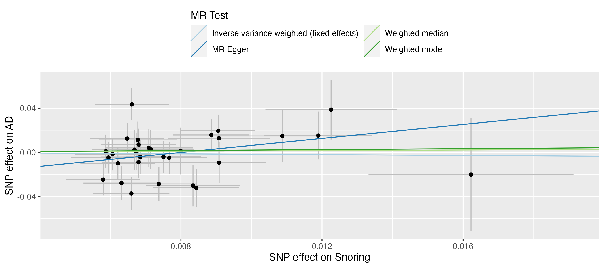
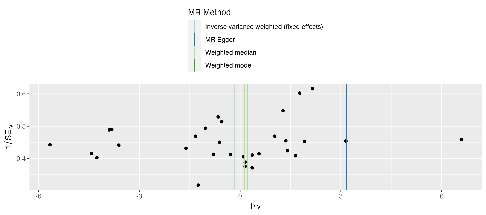
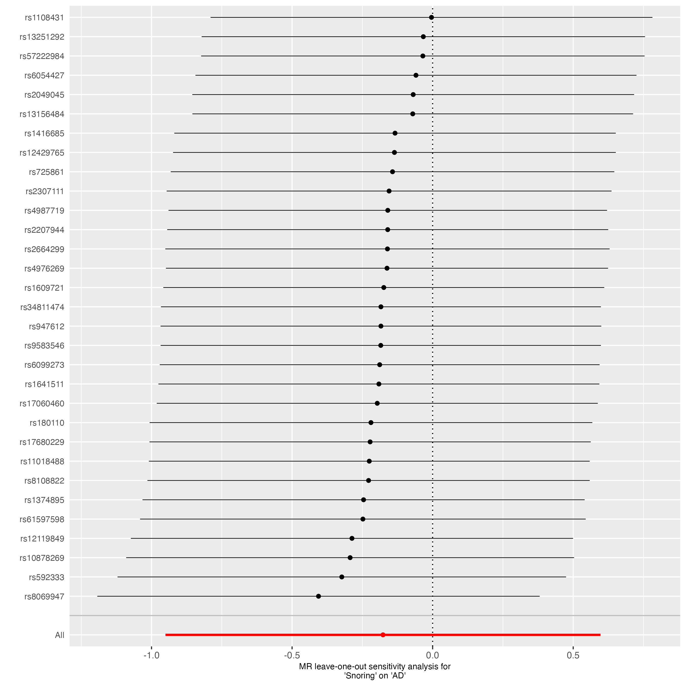
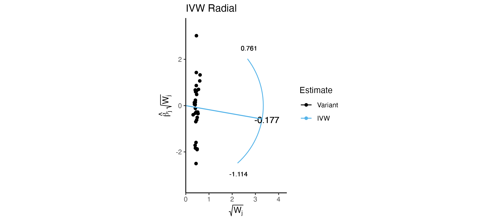
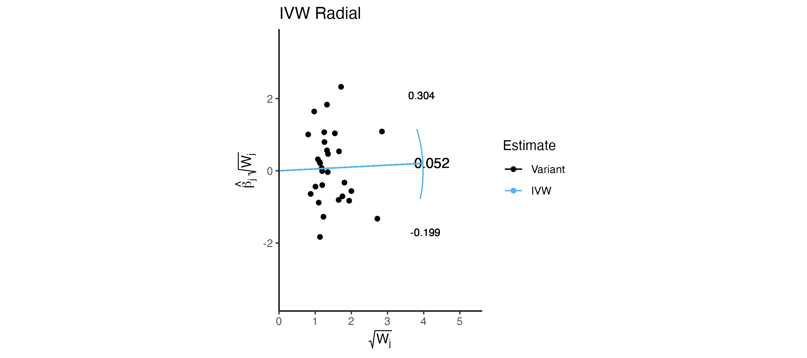

```{r setup, include=FALSE}
library(tidyverse)
library(flextable)
knitr::opts_chunk$set(echo = TRUE)
# knitr::opts_knit$set(root.dir = '~/Dropbox/Research/UCSF/Snoring-AD-MR')
```

## Datasets

Exposure: Snoring

* Campos, A. I. et al. Nat Commun 11, 817 (2020).
* Genome-wide association study on snoring (n ~ 408,000; snorers ~ 152,000) using data from the UK Biobank. Identified 42 genome-wide significant loci, with an SNP based heritability estimate of ~10% on the liability scale
* Also Snoring adjusted for BMI

Exposure: Sleep Apnea + Snoring

* Campos, A. I. et al. Sleep (2022).
* genome-wide association study (GWAS) meta-analysis of sleep apnoea across five cohorts (NTotal=523,366), followed by a multi-trait analysis of GWAS (MTAG) to boost power, leveraging the high genetic correlation between sleep apnoea and snoring. Replicated top findings in 23andMe. 49 Signficant loci, with twenty nine replicated in 23andMe

Outcome: Alzheimer's disease 

* Kunkle, B. W. et al. Nat Genet 51, 414–430 (2019).
* Genome-wide association study on Alzheimer's disease (n = 94,437) using data from the International Genomics Alzheiemr's Project. Identified 20 genome-wide significant loci

  
## Methods

Harmonization 

* LD Clumping: r^2 = 0.001; 10mb window
* p-value theshold: 5e-8
* Proxy SNPs using EUR reference, r^2 > 0.8
* palindromic SNPs: Removed (no allele frequency info for exposure)
* no snps in APOE region or GWS for outcome

TwoSampleMR (Foward)

* Primary analysis: Fixed effect Inverse Weighted Analysis
* Sensitivity analysis: Weighted median, Weighted mode, MR-Egger 
* Heterogeneity and Pleiotropy: 
  * MR-Egger Intercept 
  * Cochrans Q test
  * Radial MR
  
TwoSampleMR (Reverse)
* Primary analysis: Fixed effect Inverse Weighted Analysis
* Sensitivity analysis: Weighted median, Weighted mode, MR-Egger 
* Heterogeneity and Pleiotropy: 
  * MR-Egger Intercept 
  * Cochrans Q test
  * Radial MR
 
  
## Results (Foward)

No significant effect of snoring or sleep apnea on AD.  
```{r df, eval=T, echo=F, message=F}
res <- read_csv('../results/sleep_ad_mr_results.csv')
res %>% 
  TwoSampleMR::generate_odds_ratios() %>%
  select(method, exposure, nsnp, or, or_lci95, or_uci95, pval) %>%
  mutate_at(c("or", 'or_lci95', 'or_uci95', 'pval'), signif, digits = 2) %>%
  unite(ci, c('or_lci95', 'or_uci95'), sep = ", ") %>%
  flextable() 
```

```{r, echo=FALSE, fig.cap="Figure 1: Scatter Plot showing MR causal estimates"}


```


No significant heterogenity 

```{r het, eval=T, echo=F, message=F}
het_res <- read_csv('../results/sleep_ad_het_results.csv')
het_res %>% 
  select(exposure, method, Q, Q_df, Q_pval) %>%
  flextable() 
```

No significant pleiotropy 

```{r het_plieo, eval=T, echo=F, message=F}
het_plieo <- read_csv('../results/sleep_ad_plei_results.csv')
het_plieo %>% 
  select(exposure, egger_intercept, se, pval) %>%
  flextable() 
```


```{r, echo=FALSE, fig.cap="Figure 2: Funnel Plot showing heterogeneity"}


```


no significant outliers from LOO or Radial MR


```{r, echo=FALSE, fig.cap="Figure 3: Leave-one-out Plot showing effect of individual SNPs on causal etimate"}


```


```{r, echo=FALSE, fig.cap="Figure 4: Radial Plot showing potential outliers"}


```


## Results (Reverse)


